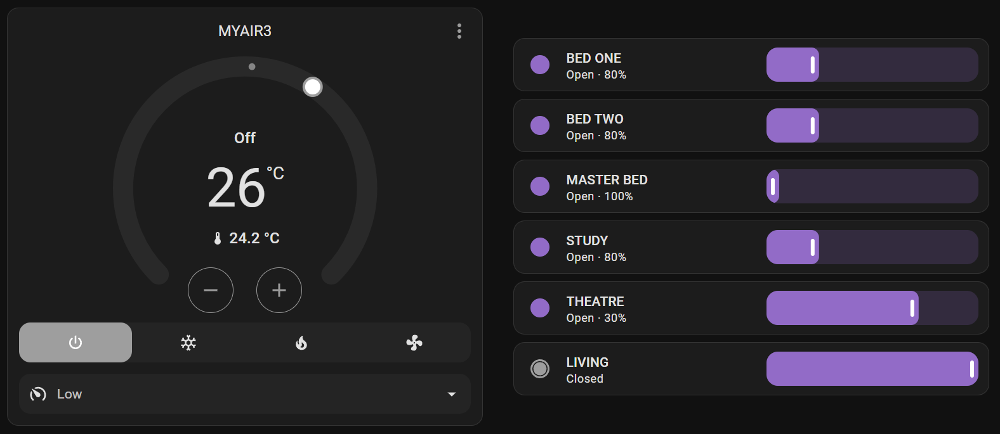

# MyAir3 Integration

This integration exposes the aircon sensors and functions made available by Advantage Air MyAir3 controllers over http to Home Assistant.

## Screenshots

## Installation

1. Install this integration with HACS

   

1. Restart HA
1. Start the configuration flow:

   

   Or: Go to `Configuration` -> `Integrations` and click the `+ Add Integration`. Select `MyAir3` from the list

1. Specify the IP address of your MyAir3 controller
